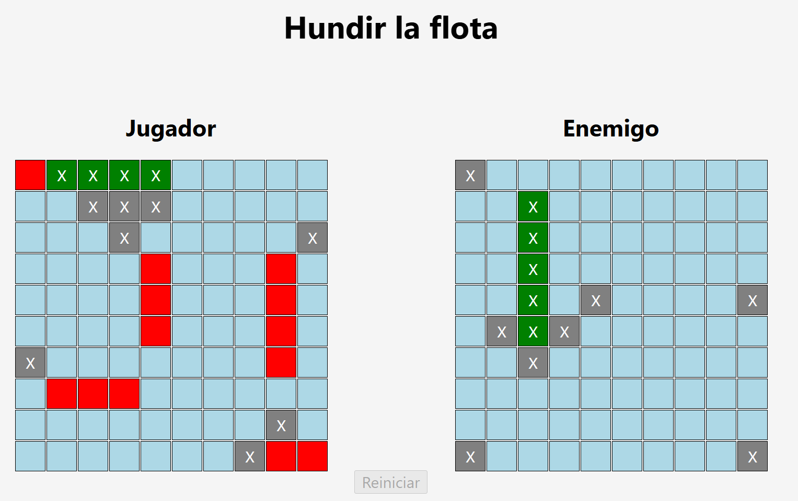

# Battleship Game

## Screenshot



## Live Demo

[View Live Game](https://pedromorenovillar.github.io/battleship/public/)

## About This Project

This project is part of The Odin Project's JavaScript curriculum. The goal was to build a fully-functional **Battleship game** using **Test-Driven Development (TDD)** principles. I implemented the complete game logic, gameboard system, and ship mechanics focusing on writing tests first, then implementing code to pass them.

## Features

- **Test-Driven Development**: Comprehensive test suite built with Jest covering all game logic
- **Gameboard System**: 10x10 grid with intelligent ship placement validation
- **Ship Mechanics**: Track hits, determine sunken ships, and handle edge cases
- **Player Management**: Multi-player turn-based gameplay system
- **Input Validation**: Prevent overlapping ships and invalid placements
- **Modular Architecture**: Clean separation of concerns with ES6 modules

## Built With


## Project Structure

```bash
battleship/
│
├── src/
│   ├── Ship.js          – Ship class with hit tracking
│   ├── Gameboard.js     – 10x10 grid and attack management
│   ├── Player.js        – Player logic and board management
│   └── Gameplay.js      – Turn-based game flow
│
├── tests/
│   ├── Ship.test.js
│   ├── Gameboard.test.js
│   ├── Player.test.js
│   └── Gameplay.test.js
│
├── public/
│   ├── images/
│   │   └── battleship.png
│   ├── index.html
│   ├── index.js
│   └── styles.css
│
└── README.md
```

## What I Learned

- Writing effective unit tests using **Jest** before implementing features (TDD methodology)
- Modularizing JavaScript code with ES6 imports/exports for maintainability
- Object-oriented design patterns including classes
- Handling complex game state management and edge cases
- Organizing larger projects with clear separation of concerns
- Validating data and preventing invalid state transitions
- Standarizing commit messages using the Conventional Commits specification

## Future Improvements

- Implement AI opponent with strategic hit patterns
- Build interactive browser UI for fleet deployment

## Acknowledgements

Project assignment and curriculum from:

- [The Odin Project](https://www.theodinproject.com/lessons/node-path-javascript-battleship)
- [Jest Documentation](https://jestjs.io/docs/getting-started)
- [Conventional Commits](https://www.conventionalcommits.org/en/v1.0.0/)

## Author

GitHub: [Pedro José Moreno Villar](https://github.com/pedromorenovillar)
